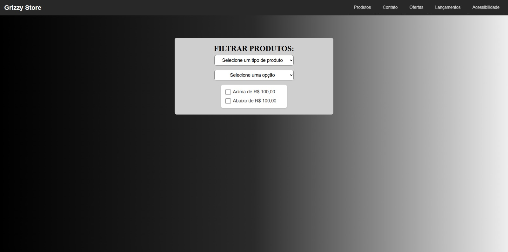
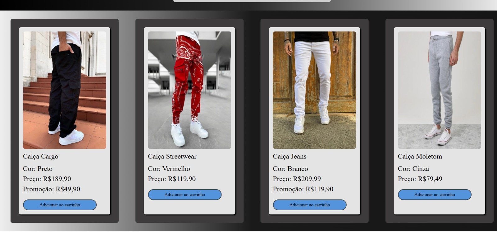
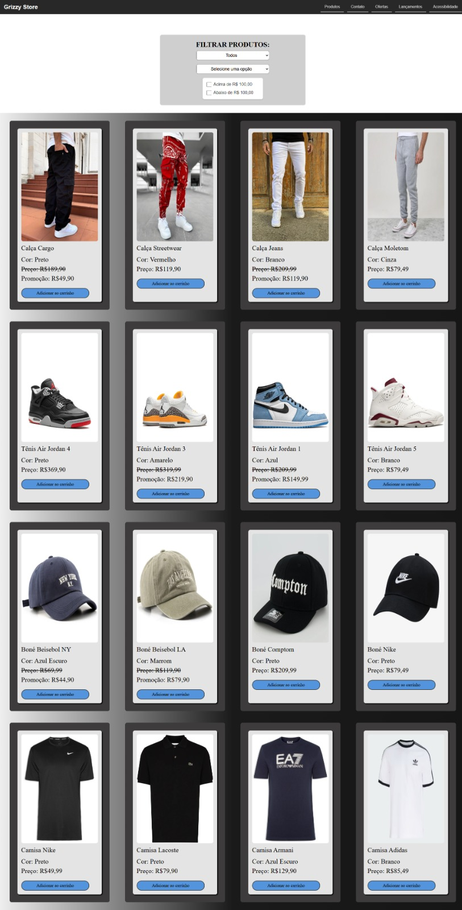
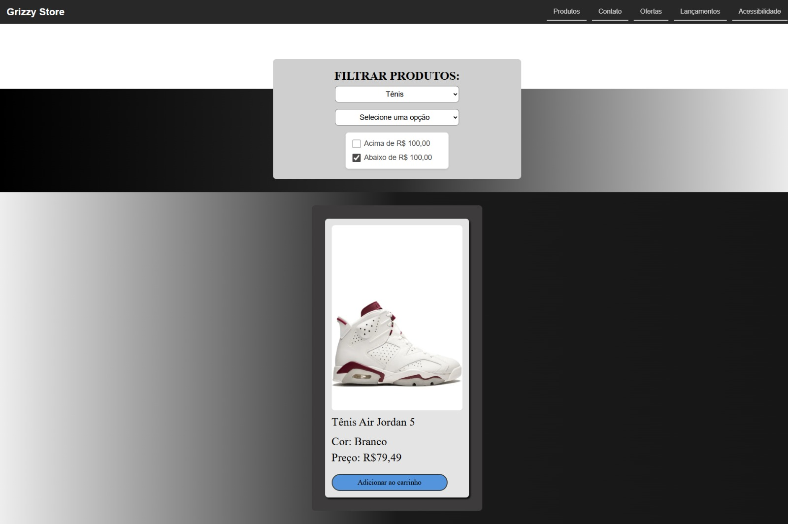
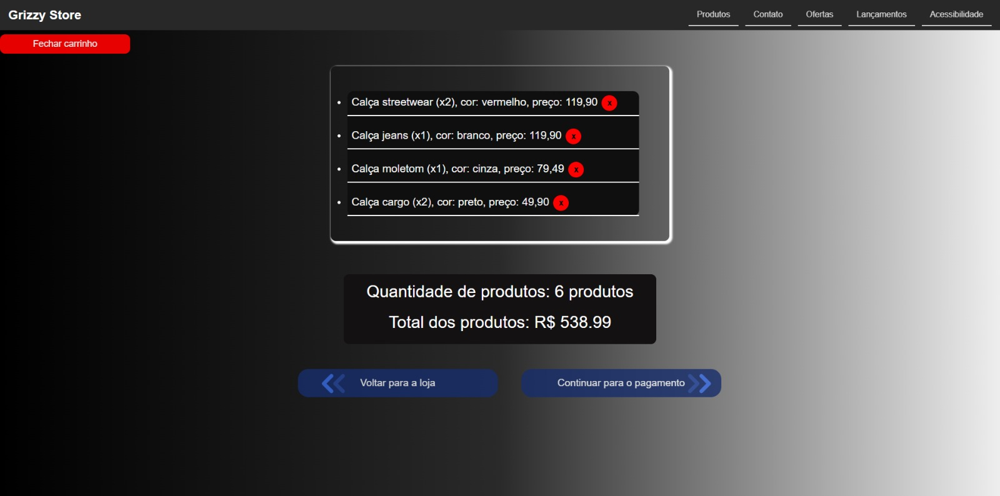
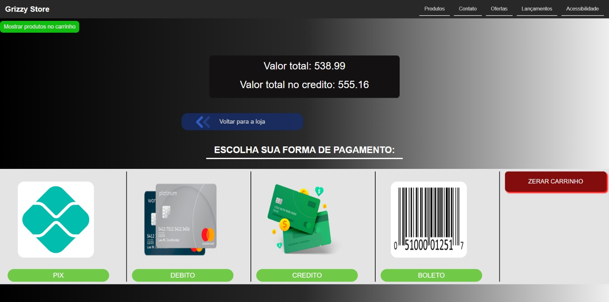

# 🛒 Loja de Produtos – Dashboard Completo

  


Uma aplicação web que simula uma **loja virtual completa**, com filtros inteligentes, carrinho funcional e sistema de pagamento com cálculos automáticos.

---

## 🌍 Sobre o projeto

Este projeto representa um **dashboard de e-commerce**, onde o usuário pode navegar por produtos, aplicar filtros e gerenciar um carrinho de compras em tempo real.

A aplicação foi desenvolvida com foco em **lógica de programação e experiência do usuário**, simulando funcionalidades presentes em lojas reais.

---

## 🖼️ Preview

<div align="center">
  
  
</div>

<div align="center">
  
  
  
</div>

<div align="center">
  
  
</div>

---

## 🚀 Funcionalidades

✔️ Filtros inteligentes de produtos:  
- Por tipo  
- Por promoção  
- Por faixa de preço  

✔️ Verificação automática de resultados (mensagem quando não há itens)

✔️ Carrinho de compras completo:  
- Adição de produtos  
- Contagem de itens  
- Soma total com promoções aplicadas  
- Remoção individual de itens  
- Limpar carrinho com um clique  

✔️ Sistema de pagamento:  
- Seleção de método de pagamento  
- Aplicação automática de desconto ou juros  
- Atualização do total em tempo real  

✔️ Interface responsiva  

---

## 🛠️ Tecnologias utilizadas

- HTML5  
- CSS3  
- JavaScript  

---

## 🌐 Deploy

Acesse o projeto online:  
👉 https://loja-produtos-alpha.vercel.app/

---

## ▶️ Como rodar o projeto

```bash
# Clone o repositório
git clone https://github.com/gabrieldev25789/loja-produtos.git

# Acesse a pasta
cd loja-produtos

# Abra no navegador
index.html


